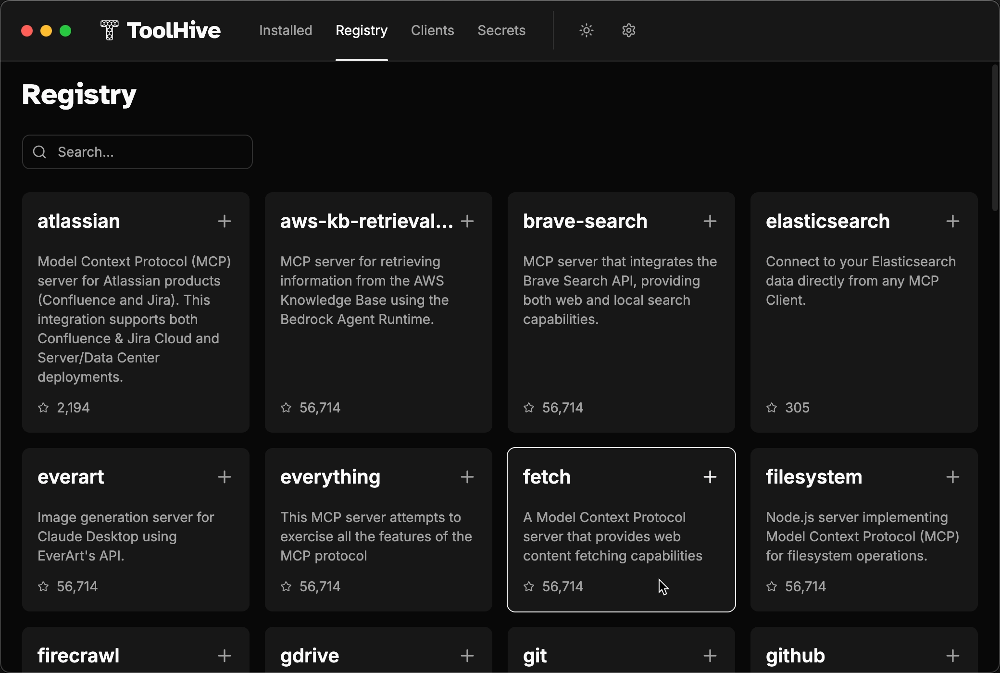

  <picture>
    
  </picture>
  <picture>
    <source media="(prefers-color-scheme: dark)" srcset="docs/images/toolhive-wordmark-white.png">
    
  </picture>
  <picture>
    
  </picture>

[![Release][release-img]][release] [![Build status][ci-img]][ci]
[![License: Apache 2.0][license-img]][license]
[![Discord][discord-img]][discord]

# ToolHive Studio - simplify and secure MCP servers

**Run any Model Context Protocol (MCP) server — securely, instantly, anywhere.**

ToolHive is the easiest way to discover, deploy, and manage MCP servers. Launch
any MCP server in a locked-down container with just a few clicks. No manual
setup, no security headaches, no runtime hassles.

<picture>
  <source media="(prefers-color-scheme: dark)" srcset="./docs/images/toolhive-studio-screenshot-dark.webp">
  
</picture>

## Quick links

- 🚀 [Quickstart](#getting-started) - install ToolHive Studio and run your first
  MCP server
  <!-- - 📚 [Documentation](https://docs.stacklok.com/toolhive/) -->
- 💬 [Discord community](https://discord.gg/stacklok) - connect with the
  ToolHive community, ask questions, and share your experiences
- 🛠️ [Developer guide](./docs/README.md) - build, test, and contribute to
  ToolHive Studio

---

<table>
<tr>
<td width="50%">

## Why ToolHive?

- **Instant deployment:** Start any MCP server with a simple graphical workflow.
- **Secure by default:** Every server runs in an isolated container with only
  the permissions it needs. Secrets are managed securely, never in plaintext.
- **Works everywhere:** Runs on Windows, macOS, or Linux.
- **Seamless integration:** ToolHive auto-configures popular clients like GitHub
  Copilot, Cursor, Claude Code, and more.

 
</td>
<td width="50%" align="center">
  <picture>
    <source media="(prefers-color-scheme: dark)" srcset="docs/images/toolhive-sources-dark.svg">
    
  </picture>
</td>
</tr>
</table>

---

## Getting started

### Prerequisites

- [Docker](https://www.docker.com/) or [Podman](https://podman.io/) installed
  and running (Docker Desktop / Podman Desktop are recommended)
- If you are using Linux, make sure your user is in the `docker` group
  ([reference](https://docs.docker.com/engine/install/linux-postinstall/#manage-docker-as-a-non-root-user)).

### Install ToolHive Studio

Download and install the latest release of ToolHive Studio for your platform:

- macOS (Apple Silicon):
  [ToolHive.Studio.dmg](https://github.com/StacklokLabs/toolhive-studio/releases/latest/download/ToolHive.Studio.dmg)
- Windows:
  [ToolHive.Studio.Setup.exe](https://github.com/StacklokLabs/toolhive-studio/releases/latest/download/ToolHive.Studio.Setup.exe)
  > [!NOTE]  
  > The Windows installer is not digitally signed yet, so you might need to
  > accept warnings from Windows Defender SmartScreen. We're working on getting
  > signing set up soon.
- Linux: download the RPM or DEB package from the
  [releases page](https://github.com/StacklokLabs/toolhive-studio/releases/latest)
  and install it using your package manager.

### Run your first MCP server

ToolHive Studio has four main areas:

- **Installed**: View and manage your installed MCP servers.
- **Registry**: Browse and install servers from the curated registry of official
  and community servers.
- **Clients**: Automatically connect your favorite clients to MCP servers.
- **Secrets**: Securely manage sensitive data required by many MCP servers.

Start by installing a simple MCP server from the registry:

1. On the **Installed** tab, click **Add server** and choose **From the
   registry**. Or, open the **Registry** tab to browse available servers.

2. Select the "fetch" server from the list. Fetch is a simple MCP server that
   fetches data from the web.

   

3. Click **Install Server** to start the server.

4. Once the server is running, click **View** on the notification or open the
   **Installed** tab to see its status.

5. Open the **Clients** tab to connect your favorite client (e.g., GitHub
   Copilot, Cursor, Claude Code). For a list of supported clients, see the
   [ToolHive documentation](https://docs.stacklok.com/toolhive/reference/client-compatibility).

6. Open your client and start using the MCP server!

   

---

## How it works

Under the hood, ToolHive Studio runs each MCP server in its own secure container
and exposes an HTTP/SSE proxy that MCP clients connect to.

<picture>
  <source media="(prefers-color-scheme: dark)" srcset="docs/images/toolhive-diagram-dark.svg">
  
</picture>

For more advanced use cases, ToolHive is also available as a command-line tool
which can be used standalone or side-by-side with ToolHive Studio and as a
Kubernetes Operator. Learn more in the
[ToolHive documentation](https://docs.stacklok.com/toolhive/).

---

## Contributing

We welcome contributions and feedback from the community!

- 🐛 [Report issues](https://github.com/StacklokLabs/toolhive-studio/issues)
- 💬 [Join our Discord](https://discord.gg/stacklok)
- 🤝 [Contributing guide](./CONTRIBUTING.md)
- 🛠️ [Developer guide](./docs/README.md)

If you have ideas, suggestions, or want to get involved, check out our
contributing guide or open an issue. Join us in making ToolHive even better!

---

## License

This project is licensed under the [Apache 2.0 License](./LICENSE).

<!-- Badge links -->
<!-- prettier-ignore-start -->
[release-img]: https://img.shields.io/github/v/release/StacklokLabs/toolhive-studio?label=Latest%20version
[release]: https://github.com/StacklokLabs/toolhive-studio/releases/latest
[ci-img]: https://img.shields.io/github/actions/workflow/status/StacklokLabs/toolhive-studio/on-main.yml?logo=github&label=Build
[ci]: https://github.com/StacklokLabs/toolhive-studio/actions/workflows/on-main.yml
[license-img]: https://img.shields.io/badge/License-Apache2.0-blue.svg
[license]: https://opensource.org/licenses/Apache-2.0
[stars-img]: https://img.shields.io/github/stars/StacklokLabs/toolhive-studio.svg?logo=github&label=Stars
[stars]: https://github.com/StacklokLabs/toolhive-studio
[discord-img]: https://img.shields.io/discord/1184987096302239844?logo=discord&logoColor=white&label=Discord
[discord]: https://discord.gg/stacklok
<!-- prettier-ignore-end -->

<!-- markdownlint-disable-file first-line-heading no-inline-html -->
